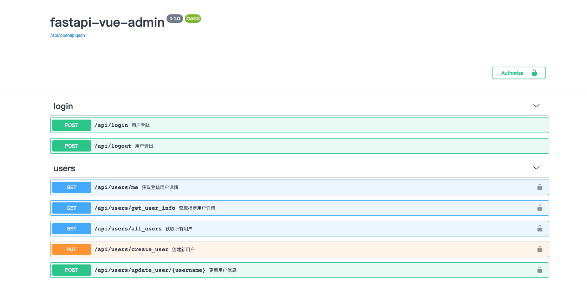
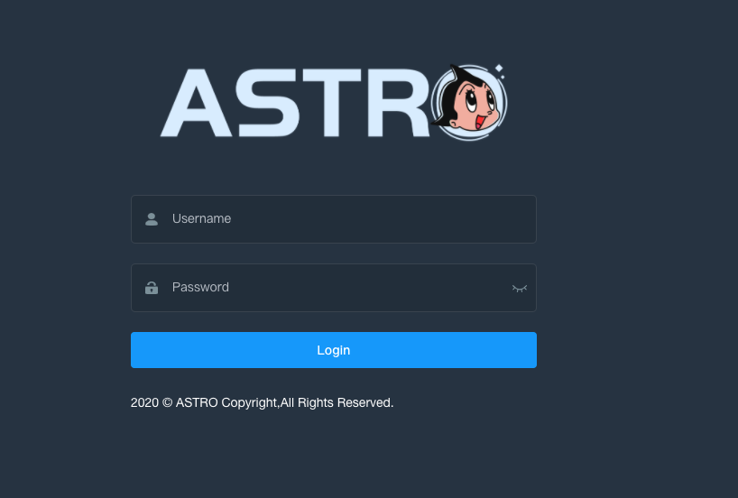
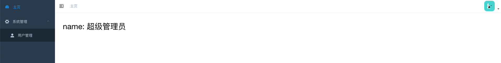

# fastapi-vue-admin
使用fastapi和vue-element-admin构建的管理后台

目前配置直接写在配置文件中,生产环境推荐使用Nacos作为配置中心

## 项目初始化
```shell script
pip install -r requirements.txt -i  https://pypi.tuna.tsinghua.edu.cn/simple
在安装mysqlclient时会出现报错，解决方法如下:
https://blog.csdn.net/alvechen/article/details/95040255

数据库初始化
数据库更新使用alembic
alembic init alembic
修改alembic的ini文件，将链接地址改为正确的
修改alembic env文件，添加如下内容
import os
import sys
# 把当前项目路径加入到path中
sys.path.append(os.path.dirname(os.path.dirname(__file__)))
from models.base import Base
target_metadata = Base.metadata
注释掉 target_metadata = None

生成执行文件
alembic revision --autogenerate -m "first commit"
alembic upgrade head
```

## 项目启动
```shell script
python main.py
```

## 初始化数据
表结构创建完成后执行目录下的init.sql文件插入初始数据

### 查看项目swagger
访问http://localhost:端口号/docs即可



### 启动前端
```shell script
cd front
npm install --registry=https://registry.npm.taobao.org
npm run dev
```

#### 登陆页面
初始账户密码:admin/123456


#### 主页

